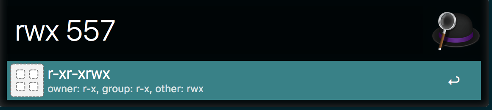

# alfred-rwx

Alfred workflow that explains unix file access modes.

## Installation

Download the workflow from the [release page](https://github.com/nyukhalov/alfred-rwx/releases).
Open `rwx.alfredworkflow` and Alfred will walk you through the installation process. 
No configuration is necessary.

## Usage

Start a command with `rwx` and then pass access mode code.

